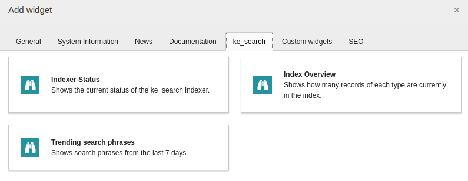
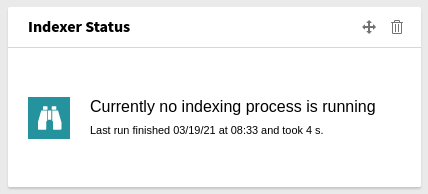
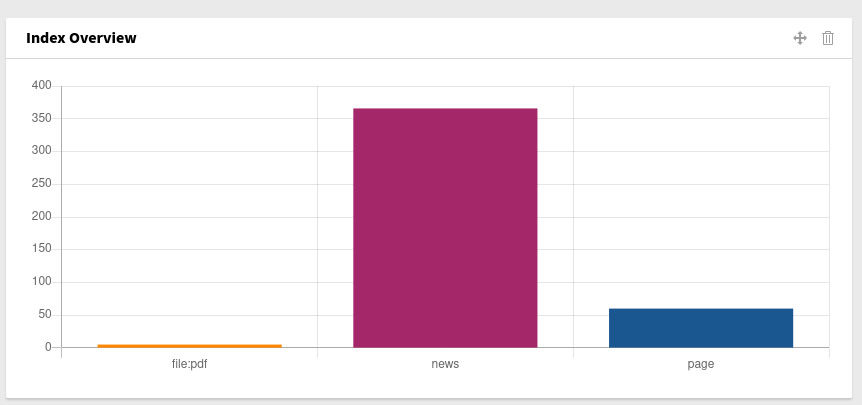
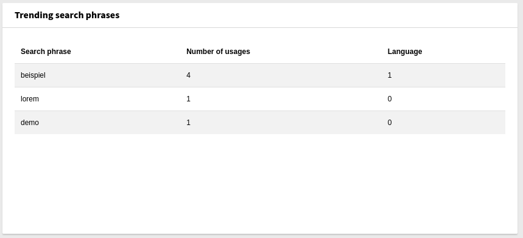

.. ==================================================
.. FOR YOUR INFORMATION
.. --------------------------------------------------
.. -*- coding: utf-8 -*- with BOM.

.. _backend:

Backend
=======

In the backend you can use the dedicated module to start the indexing process, view the indexed content or statistical data.

A scheduler task is provided to start the indexing process automatically (see :ref:`indexing`).

There are also widgets for the dashboard which show some information at a glance.

Dashboard widgets
-----------------

Add a widget
~~~~~~~~~~~~

Status widget
~~~~~~~~~~~~~
This widget shows if the indexer is currently running (and for how long) and when and for how long the last indexing
process took place.

Index overview widget
~~~~~~~~~~~~~~~~~~~~~
This widget shows how many records of each type are currently stored in the index.

Trending search phrases
~~~~~~~~~~~~~~~~~~~~~~~
This dashboard widget shows the search phrases used in the last seven days for the whole system (ignoring the folders in
which the data is stored), how often they have been used and in which language.

