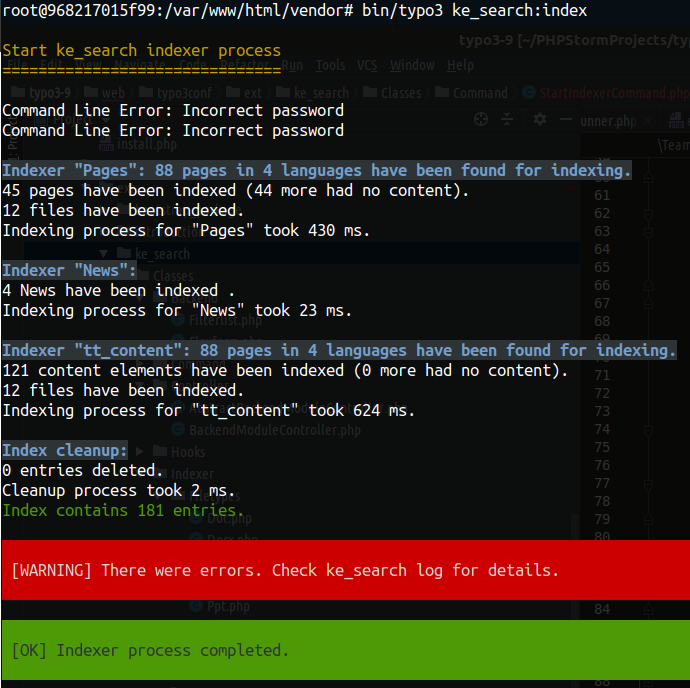
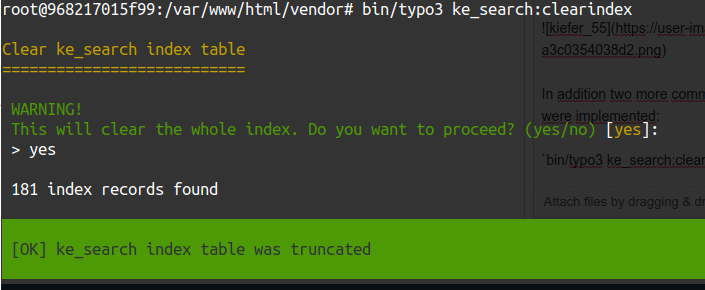
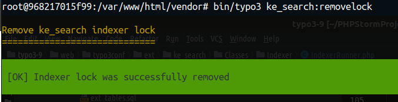

.. ==================================================
.. FOR YOUR INFORMATION
.. --------------------------------------------------
.. -*- coding: utf-8 -*- with BOM.

.. _commandline:

Command Line Tools
==================

Certain ke_search functions can be accessed via the command line.

Start the indexer
.................

.. code-block:: none

	bin/typo3 ke_search:indexing

Clear the index
...............

.. code-block:: none

	bin/typo3 ke_search:clearindex

Remove the indexer lock
.......................

.. code-block:: none

	bin/typo3 ke_search:removelock

