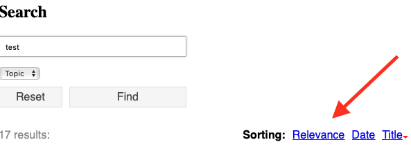

.. ==================================================
.. FOR YOUR INFORMATION
.. --------------------------------------------------
.. -*- coding: utf-8 -*- with BOM.

.. _sorting:

Sorting
=======

You may define the sorting method in the plugin configuration. Available options are “relevance”, “titel” and “date”.
More options may be added through third party extensions (see below “adding your own sorting options”).

There are two sorting method options, one if a searchword was given and one if only filters have been used without
a searchword. The reason for that is without a searchword, you don't have a relevance ranking.

Default sorting is “relevance descending” if a searchword has been given and “date descending” if no
searchword has been given.

.. image:: ../Images/Configuration/sorting-plugin-settings.png

You may also activate the “frontend sorting” feature. This allows the visitor to decide for a sorting method.

You may then choose the fields you want to allow sorting for. By default these are “relevancy”, “date” and “title”.

Adding your own sorting options
-------------------------------

If you want other sorting options than relevance, date or title, you will have to

* Extend the table “tx_kesearch_index” by the fields you want to use for sorting (for example “mysortfield”).
* Write your own indexer or extend an existing one that fills your new index field during the indexing process.
* Register your sorting fields by hook „registerAdditionalFields“, so that they are written to db when indexing

.. code-block:: none

	public function registerAdditionalFields(&$additionalFields) {
	  $additionalFields[] = 'mysortfield';
	}

Your new database field will automatically appear in the backend selection of sorting fields!

You will have to add a locallang-value to your typoscript setup:

.. code-block:: none

	plugin.tx_kesearch_pi2 {
		_LOCAL_LANG.default {
			orderlink_mysortfield = My sort field label
		}
	}

