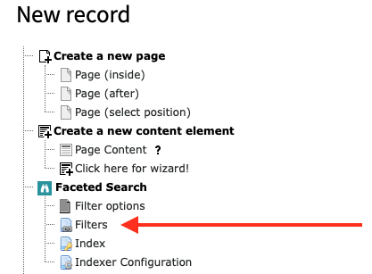
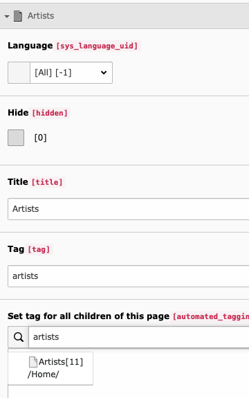
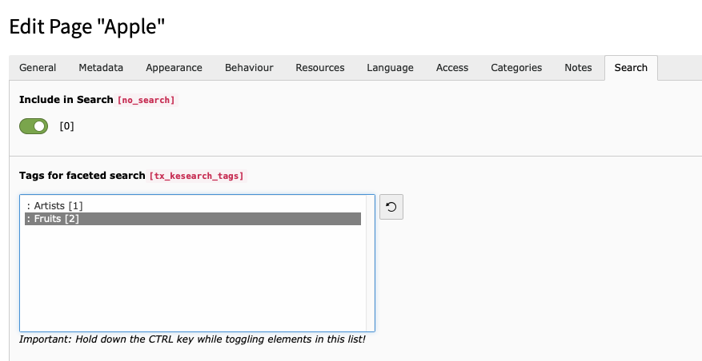
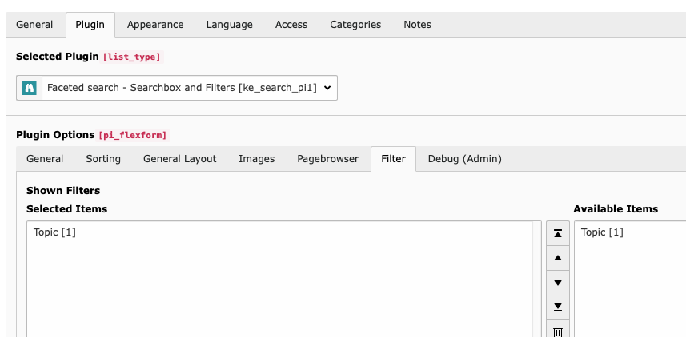
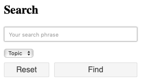

.. ==================================================
.. FOR YOUR INFORMATION
.. --------------------------------------------------
.. -*- coding: utf-8 -*- with BOM.

.. _filtersetup:

Faceted Search Setup
====================

Follow these steps to set up faceted search:

Create a filter
...............

Go to your search storage folder and use the list module to create a "filters" record. For each
category you want to use in your faceted search in the frontend you will have to create one filter.

Create filter options
.....................

Add new Filter options by adding them inside the filter record. For each option you want to display in the frontend you
will have to add one filter option.

Tags
....

Tags are used internally to mark content as relevant for a certain filter option. You will have to choose a
tag name for each filter.

NOTES:

* You may freely choose a tag name, they're only used for internal purposes. But make sure the
  tag you choose for each filter option is unique. If you decide to give the same tag to different filter options,
  they will show the same search results. Although, this may be a desired behaviour in some cases.
* The tag has to be at least four characters long and must contain only alphanumeric characters.
  Up to version 3.3.1 it was possible to use dashes, colons, spaces and other non-alphanumeric characters
  as tags. This behaviour has changed and you may need to re-index when tags have changed or adjust your custom
  scripts if you set tags in your scripts.
* You must not use "syscat" as prefix for your tag names. This is reserverd for the automated generation of filter
  options, see :ref:`systemcategories`.

You have two possibilities to assign tags to pages:

1. Open the page properties and in the tab "Search" you find field "Tags for faceted search"
2. Use the function "Set tag for all children of this page" in the filter record itself.

If you use the option "Set tag for all children of this page" the tag will be set automatically to
the subpages of the page you set while indexing that pages (you can select multiple pages).

With the exclude option you can prevent child pages from being tagged automatically.

If you do not want to set the tag for pages automatically, you can choose to set the tag on each page manually in
the tab "Search" in the page properties.

The tags will be added to the index entry of that page at the time the indexer reads that page
and writes its content to the index.

NOTE: You will first have to create at least one "filter" and one "filter option" to see any items in this list.

If you have a multilingual website, the tagging can be done only in the main language. But you can translate the
filter options so that they will be visible in the frontend in the correct translation.

The filter options are coming from the whole system, no matter on what page you created them.

If you have more than one search plugin, you may want to restrict the filter options displayed here to a certain folder.
You can do this by adding this to your PAGE-TSConfig, where 1234 is the uid of your folder where the desired filter
options are stored:

.. code-block:: none

	tx_kesearch.filterStorage = 1234

Add filter to search plugin
...........................

Open your search plugin and select the filters you want to display in the tab "filter".

The filter will then be displayed in the frontend.

Note on indexing
................

The tags will be applied after the next indexing. So whenever you change the filters, re-index after that.

