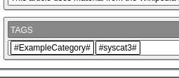
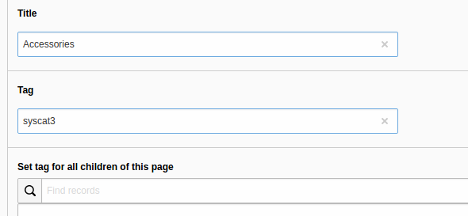

.. ==================================================
.. FOR YOUR INFORMATION
.. --------------------------------------------------
.. -*- coding: utf-8 -*- with BOM.

.. _systemcategories:

Using system categories for filtering
=====================================

You can use the system categories the TYPO3 core provides for filtering.

ke_search automatically creates tags for assigned system categories, this applies to the pages and the news indexer.
But it only creates the tags, you will have to create the filter options yourself and use the auto-generated tag names.

For each assigned system categorie, two tags are created:

1. The first tag uses this naming schema "syscat" + UID of the system category (eg. "syscat123")
2. The second tag uses the title of the category. Spaces and the following characters will be removed: # , ( ) _ &

NOTE:

* If you use the tag derived from the categoy title remember that this will change if the category title changes. It
  may be better to use the tag which relies on the uid of the category.

The auto-generated tags can be used in filter options:

