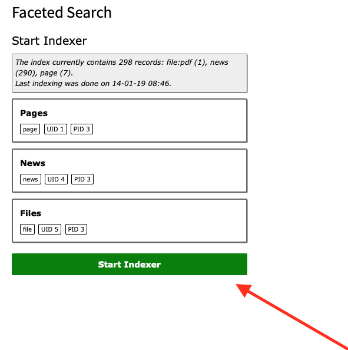

.. ==================================================
.. FOR YOUR INFORMATION
.. --------------------------------------------------
.. -*- coding: utf-8 -*- with BOM.

.. _indexing:

Indexing
========

For each content type (pages, news, ...) ke_search needs an "indexer".
Once an indexer is available, you can use it and create an "indexer configuration" to indexer your content. You will
have to create an indexer configuration for each content type you want to index (pages, news, …). You may
create more than one indexer configuration of one type, eg. two page indexer configurations for different page trees.

Use the list module an open your search storage page and create an "indexer configuration" record.

Configure the indexer configuration:

* Set the title, this field is used only internally.
* Set the storage page for the index. Set this page to your search storage folder.
* If you are working with filters, you can define that every index entry gets a tag automatically if it has been indexed by this indexer by setting "Add tag to all indexed elements" to a filter option you like. By doing so you can for example create a filter by content type (news, page, event, ...) if you have an indexer for each content type. Please remember that you will have to create the filter options first.

The other indexer configurations options differ from type to type.

Whenever the content in your website changes, the indexing process will have to be started to reflect that changes in
the search result.

Manual indexing
...............

You can start the indexing process in the ke_search backend module.

Automated indexing
..................

For keeping the index up-to-date we recommend using the TYPO3 scheduler.

ke_search comes with a task for the TYPO3 scheduler.

* Create a new task, choose “Indexing process for ke_search (ke_search)” in field “Class” and configure the frequency as you need it (eg. hourly or daily).
* Deactivate  the “Allow Parallel Execution” option.

Important: If you use the file indexer, you need to give the backend user _cli_scheduler access to all the needed file mounts.

Available indexers
..................

ke_search comes with indexers for the most important content types.

.. toctree::
	:maxdepth: 3
	:titlesonly:
	:glob:

	IndexerTypes/Pages
	IndexerTypes/ContentElements
	IndexerTypes/News
	IndexerTypes/TtNews
	IndexerTypes/Addresses
	IndexerTypes/Files
	IndexerTypes/Custom
	IndexerTypes/CustomContentFields

