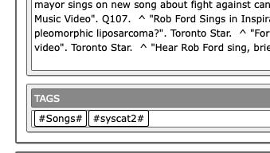
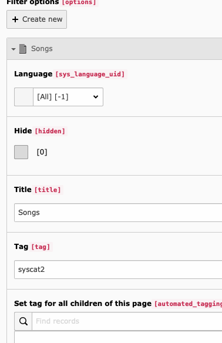

.. ==================================================
.. FOR YOUR INFORMATION
.. --------------------------------------------------
.. -*- coding: utf-8 -*- with BOM.

.. _newsIndexer:

News (EXT:news)
===============

With this indexer you can index news from the extension "news" (extension key "news", not "tt_news").

The following fields will be indexed: title, teaser, content, author, author E-Mail, keywords.

Access limitations will be taken into account. You can either index all news or news from certain categories.

An image will be shown in the result list if you activate that setting in the ke_search searchbox plugin. The first assigned image will be shown.

Configuration
-------------

In order to index news, create a new indexer configuration an configure it as follows:

* Title: just for internal use
* Storage: the folder all your search data is saved in.
* Target page: The page your news detail view plugin is placed on.
* Type: has to be "News (news)".
* Record storage page(s) single/recursive: Folders with news data to index.
* Category selection: Here you can define if you want to index all news or just news from selected categories. Important: This selection is not recursive. You have to select each category individually if you don't select "all".
* Add tag(s) of parent folder: If you added a tag to the folder containing news, this / these tag(s) will be added to the news index entry.
* File indexer: Define which extensions of related files will be indexed.
* Attached files should be handled as: Define if the contents of related files will be indexed as separate index records or as content of the news index record.
* Add tag to all indexed elements: You can select an already existing filter option / tag to add it to all indexed elements.

Alternative single view page from category
------------------------------------------

In the indexer configuration you can set a target page. When a news appears in the result list, the link will go to
that page. On that page there has to be a news plugin showing the detail view.

If a news has a category assigned to it which has an alternative single view page, this page will be used as target page.

Filtering with system categories
--------------------------------

The extension "news" allows you to categorize with categories, keywords and tags.

In order to use news with facetting, indexed news get *tagged automatically*. But you will still have to create
a filter option with the corresponding tag.

These tags are generated as follows:

* from news-categories (system-categories)
* from news-keywords
* from news-tags

Example: If you want to filter for seasons, you can use the news categories "summer" and "winter". In ke_search you
will then have to add the filter options eg. "All about the summer" and "Winter stuff" with the tags corresponding to
the categories names: "summer" and "winter".
Make sure the categories and the ke_search tags are spelled the same. For tags and keywords it's the same principle.

Tags will be generated by applying the rules for tags (no spaces and special characters).
For example, if you have category "Blue cars!", a tag named "Bluecars" will be created.

For categories there will also be tags which are based on the string "syscat" and the id of the cateogry, eg.
"syscat123". This tags don't change if the category name changes.

To automatically create and update filters for these tags, see :ref:`systemcategories`.

File indexing
-------------

Files attached to news records will be indexed. You can specify in the indexer configuration wether to include the
content of the files into the news record search result, that means they will appear as one result, or to index files
separately, making them show up as a individual result.

You can also specify which files should be indexed by defining a comma-separated list of file extensions. If you
leave this field empty, no files will be indexed.
