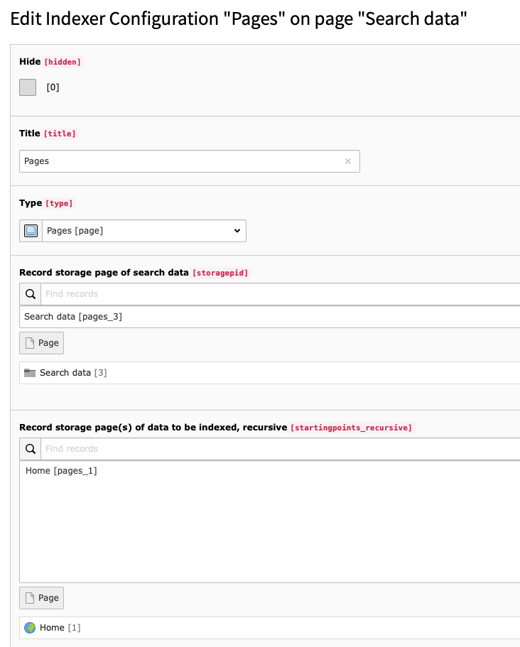
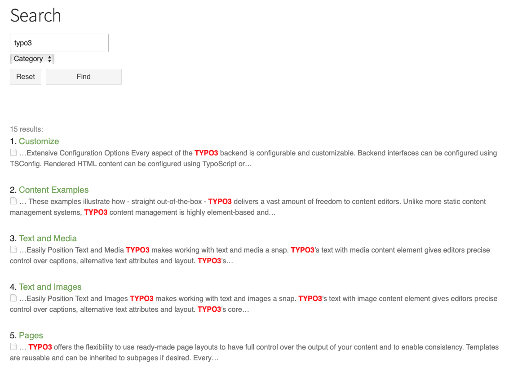

.. ==================================================
.. FOR YOUR INFORMATION
.. --------------------------------------------------
.. -*- coding: utf-8 -*- with BOM.

.. _examples:

Examples
========

Indexer configuration
---------------------

Basic result list
-----------------

Live examples
-------------

Here are examples on how a search result list can be used to display either a more classical list of search results
or results in form of tiles. It is even possible to use only the faceting possibilities and skip the fulltext search.

* https://www.hs-geisenheim.de/suche/?tx_kesearch_pi1%5Bsword%5D=biologie
* https://www.wiko-greifswald.de/mediathek/
* https://www.hochschule-bochum.de/studium/bildungsangebot/studiengangsuebersicht/
