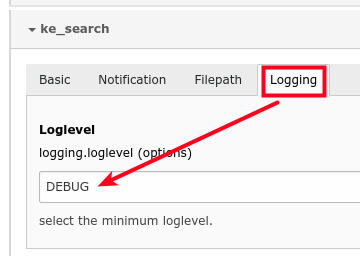
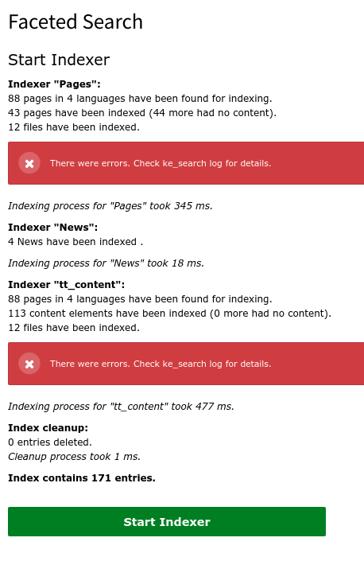

.. ==================================================
.. FOR YOUR INFORMATION
.. --------------------------------------------------
.. -*- coding: utf-8 -*- with BOM.

.. _logging:

Logging
=======

Logging uses the TYPO3 Logging API.

The "minimum log level" is configurable in extension manager configuration (default: error).

Log messages matching the configured minimum log level are written into a seperate logfile (e.g. var/log/typo3_kesearch_3765640ce4.log) with content like this:

.. code-block:: none

	Thu, 20 Dec 2018 14:12:20 +0100 [NOTICE] request="d40b2d51fe977" component="TeaminmediasPluswerk.KeSearch.Indexer.IndexerRunner":
	============================
	= Indexing process started =
	============================
	Thu, 20 Dec 2018 14:12:21 +0100 [ERROR] request="d40b2d51fe977" component="TeaminmediasPluswerk.KeSearch.Indexer.IndexerRunner": The path to catdoctools is not correctly set in the extension manager configuration. You can get the path with "which catdoc".
	Thu, 20 Dec 2018 14:12:21 +0100 [ERROR] request="d40b2d51fe977" component="TeaminmediasPluswerk.KeSearch.Indexer.IndexerRunner": The path for xls2csv is not correctly set in extConf. You can get the path with "which xls2csv".
	Thu, 20 Dec 2018 14:12:21 +0100 [ERROR] request="d40b2d51fe977" component="TeaminmediasPluswerk.KeSearch.Indexer.IndexerRunner": The path to catppttools is not correctly set in extension manager configuration. You can get the path with "which catppt".
	Thu, 20 Dec 2018 14:12:21 +0100 [WARNING] request="d40b2d51fe977" component="TeaminmediasPluswerk.KeSearch.Indexer.IndexerRunner": Could not index file /var/www/html/web/fileadmin/test/test-invalid.xlsx.
	Thu, 20 Dec 2018 14:12:21 +0100 [WARNING] request="d40b2d51fe977" component="TeaminmediasPluswerk.KeSearch.Indexer.IndexerRunner": Could not index file /var/www/html/web/fileadmin/test/test-invalid.docx.
	Thu, 20 Dec 2018 14:12:21 +0100 [WARNING] request="d40b2d51fe977" component="TeaminmediasPluswerk.KeSearch.Indexer.IndexerRunner": Could not index file /var/www/html/web/fileadmin/test/test-invalid.pptx.
	Thu, 20 Dec 2018 14:12:21 +0100 [WARNING] request="d40b2d51fe977" component="TeaminmediasPluswerk.KeSearch.Indexer.IndexerRunner": Could not index file /var/www/html/web/fileadmin/test/pdf-example-password.original.pdf.

Indexing errors and main indexing database operations are catched.

The "could not index file..." messages were removed from the indexing report (which is shown in the backend module and
written to the sys_log) and replaced by a message pointing to the logfile.

