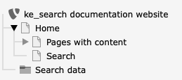
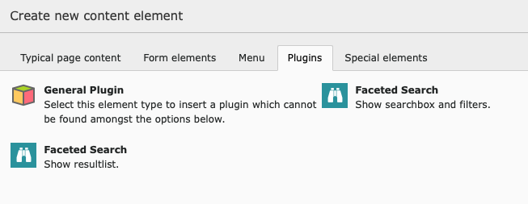
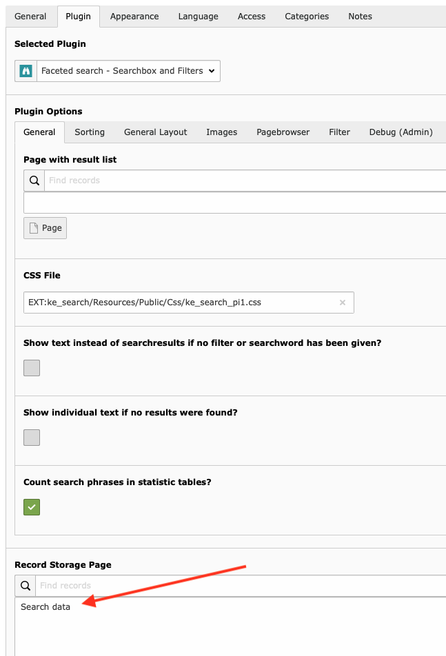
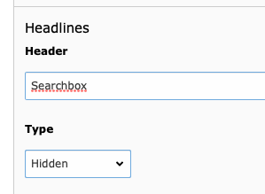
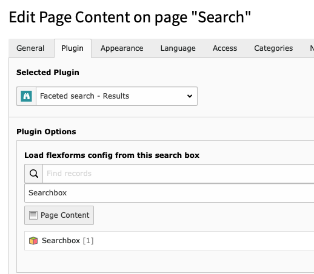
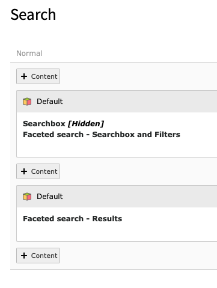
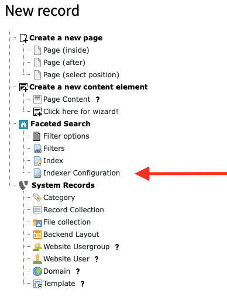
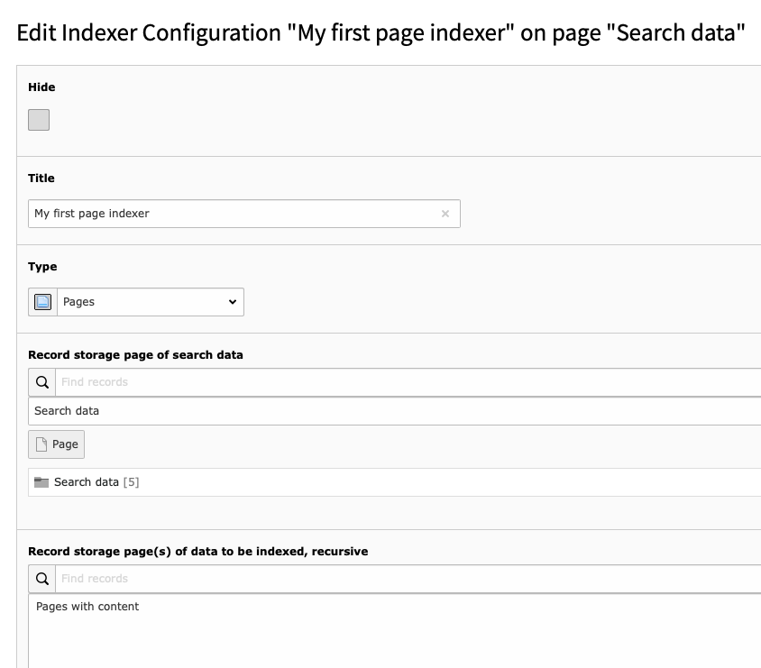
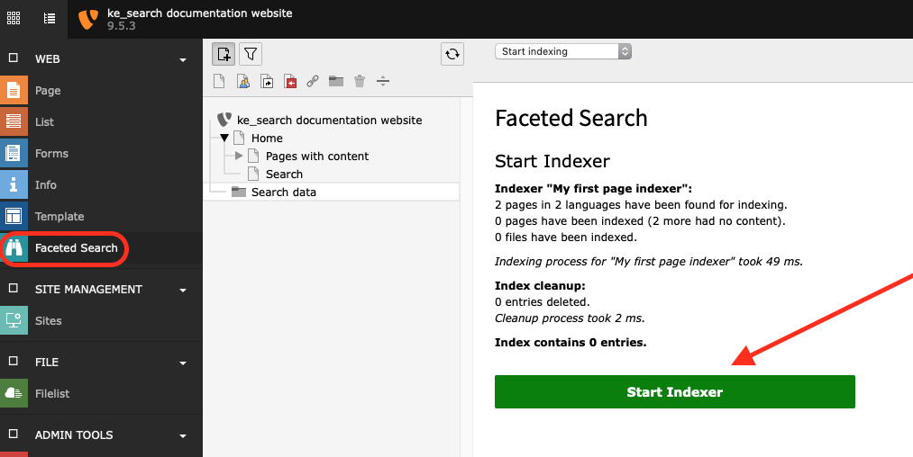

.. ==================================================
.. FOR YOUR INFORMATION
.. --------------------------------------------------
.. -*- coding: utf-8 -*- with BOM.

.. _quickstart:

Quick start
===========

Follow the steps below to set up a simple fulltext search for your pages.
In order to use the faceting feature see "Faceting".

Download and installation
-------------------------

Install the extension ke_search via extension manager or via composer (recommended):

.. code-block:: none

	composer require teaminmedias-pluswerk/ke_search

You can find the current version (and older ones) at

https://github.com/teaminmedias-pluswerk/ke_search/releases

Include static template
-----------------------

In your main template include the "static template" of the extension ke_search.

Create pages
------------

Create a new page called "Search" (or similar) and a sysfolder called "Search data" (or similar).

Configure Plugins
-----------------

You need to create two plugins: The searchbox and the resultlist.

First, create a plugin "Faceted Search: Show searchbox and filters" on the page "Search".

Fill in the field "Record Storage Page" in the Tab "Plugin" -> "General" with the Systemfolder that you created in
step 2 (our example: 'Search data').

NOTE: It is useful to give the Plug-In "Searchbox and Filters" a Header (our example: 'Searchbox').
That makes it easier to identify the correct content element in the next step.

Create a plugin "Faceted Search: Show resultlist" on the page "Search".

In the field "load flexform config from this search box" fill in the Search-Plug-In that you created in Step 3 (our example: "Searchbox").

After this steps, you should have two plugins on your search page.

Create the indexer configuration
--------------------------------

Use the "list" module to create an indexer configuration on the page "Search data".

* Choose a title.
* Set the type to "page".
* Set the "record storage page" to your sysfolder "Search data".
* Choose the pages you wish to index. You can decide whether the indexing process runs on all pages recursively or if only one page will be indexed. You can combine both fields.

Start Indexer
-------------
Open the backend module “Web → Faceted Search” and start the indexing process.

You're done!

Open the page "Search" in the frontend and start finding...