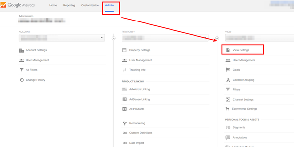
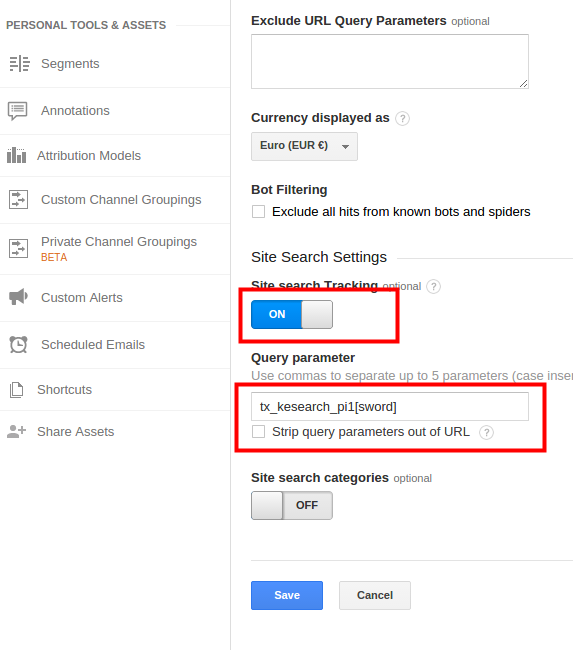
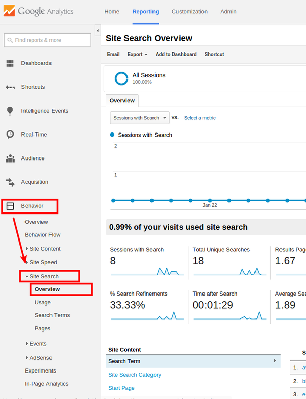

.. ==================================================
.. FOR YOUR INFORMATION
.. --------------------------------------------------
.. -*- coding: utf-8 -*- with BOM.

.. _googleanalytics:

Statistics using Google Analytics
=================================

If you use Google Analytics on your website, you can use it to generate a report for search queries:

Enable "Site Search" in Google Analytics and enter the search query "tx_kesearch_pi1[sword]".
Go to "Behaviour --> Site search" to see the report.

Open the admin view.

Activate site search.

Search queries will be reported under "Behaviour".