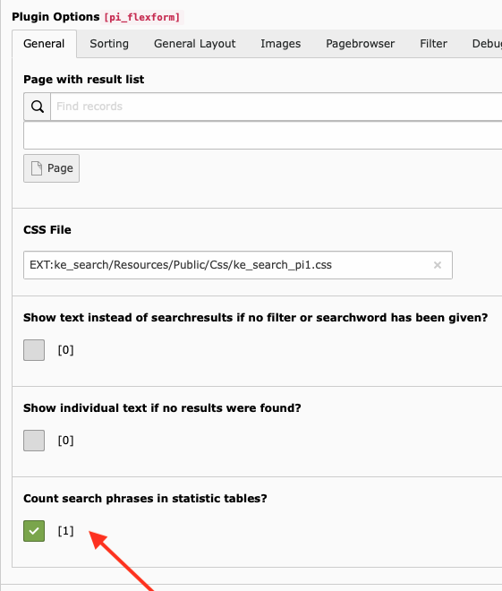
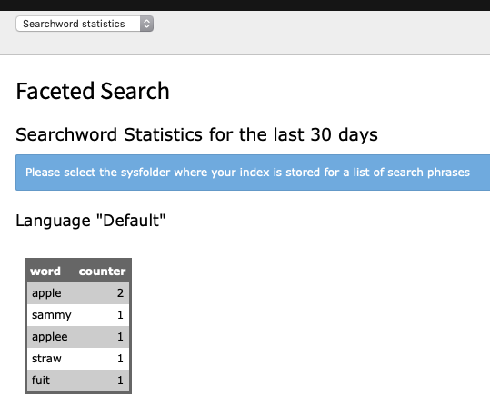

.. ==================================================
.. FOR YOUR INFORMATION
.. --------------------------------------------------
.. -*- coding: utf-8 -*- with BOM.

.. _statistics:

Statistics
==========

All the search words that are submitted by frontend users are stored in statistic tables. This function is activated
by default but can be deactivated in the plugin configuration.

You can see the statistics in the backend module by selecting "Searchword statistics", or by using the dashboard widget.

The dashboard widget shows the search phrases used in the last seven days for the whole system (ignoring the folders in
which the data is stored).

The backend module function shows a simple statistic of the submitted searchwords of the last 30 days. The statistic shows the
cumulative values for single searchwords. Maybe this will be extended in a later version.

Differences between sysfolders and other pages
----------------------------------------------

If you call the statistics function for a sysfolder you will get the cumulative values
for all statistic data that is stored there. If you call it for a page of another type you
will get the cumulative values for searchwords that were entered on this explicit page.

Technical background
--------------------

Search phrases go to the table “tx_kesearch_stat_search”. Single search words are stored
in the table “tx_kesearch_stat_words”.
The statistic data is stored in the sysfolder that is set as the first storage point in your plugin configuration.
Make sure that you set the flexform configuration option for activating the statistics function
in the correct plugin if it does not work as expected. E.g. if you have several searchbox plugins
that point to one central search result page, the value must be set on this result page.

More options
------------

.. toctree::
	:maxdepth: 3
	:titlesonly:
	:glob:

	GoogleAnalytics/GoogleAnalytics
