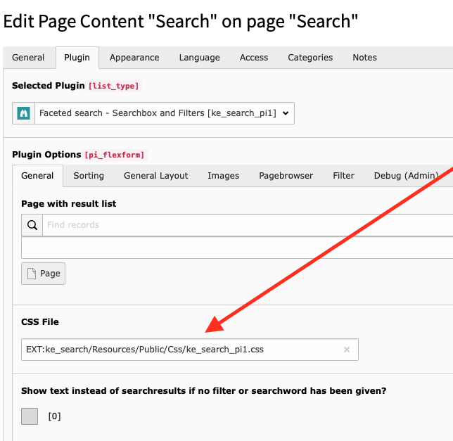

.. ==================================================
.. FOR YOUR INFORMATION
.. --------------------------------------------------
.. -*- coding: utf-8 -*- with BOM.

.. _templatingCss:

Use your own CSS
================

ke_search comes with a default css file which is loaded automatically.

If you do not wish to use that file, you have the following possibilities.

Unset via typoscript
--------------------

If you do not wish to load that file, you can unset it via typoscript:

.. code-block:: none

	plugin.tx_kesearch_pi1.cssFile >
	plugin.tx_kesearch_pi2.cssFile >

Use plugin configuration
------------------------

You can also make use of the field in the plugin configuration. This overwrites the default css file.

