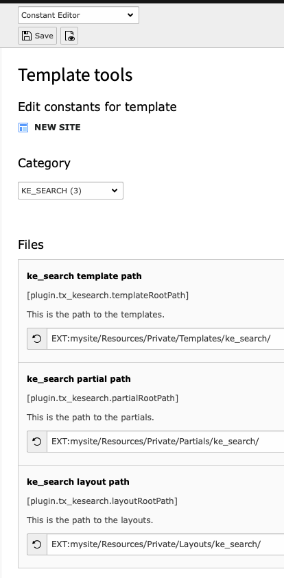

.. ==================================================
.. FOR YOUR INFORMATION
.. --------------------------------------------------
.. -*- coding: utf-8 -*- with BOM.

.. _custom-templates:

Use your own Templates
======================

In order to use your own fluid templates, please set the path to your templates in the typoscript *constants*.

It's good practice to put the templates in a dedicated "site" package (an extension which holds all your
templates, configuration and css files).

For example:

.. code-block:: none

	plugin.tx_kesearch.templateRootPath = EXT:mysite/Resources/Private/Templates/ke_search/
	plugin.tx_kesearch.partialRootPath = EXT:mysite/Resources/Private/Partials/ke_search/
	plugin.tx_kesearch.layoutRootPath = EXT:mysite/Resources/Private/Layouts/ke_search/

You can use the *Constant Editor* to set the paths to your templates, partials and layouts.

In order to use your own templates please copy the default templates to your own package.

.. code-block:: none

	typo3conf/ext/ke_search/Resources/Private

It is not neccessary to copy all templates, partials and layouts to adjust the templates, you can just copy the
files you need to change. You will then have less hassle when templates change with a new version. All other files
will fall back to the default.
