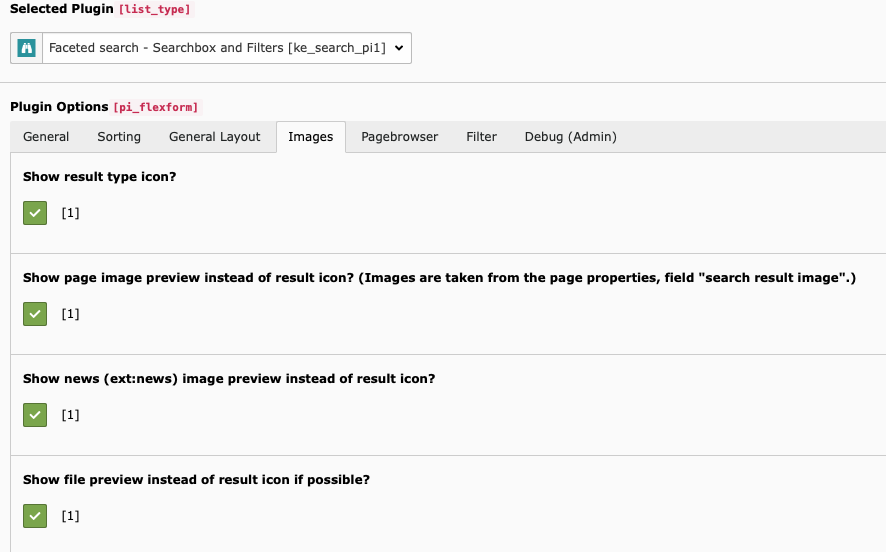

.. ==================================================
.. FOR YOUR INFORMATION
.. --------------------------------------------------
.. -*- coding: utf-8 -*- with BOM.

.. _templatingImages:

Images
======

ke_search renders images (icons and thumbnails) in the list view for the folllowing cases.

* Icons for the type of result (page, news, file, ...)
* Preview images for pages
* Preview images for news (using the first image of the news record)
* Preview images for files (thumbnails will be created automatically for PDF and image files)

You can enable / disable them in the plugin configuration.

Type-Icons
----------

You can change the icons which are used in the list view.

Example configuration (Template Setup):

.. code-block:: none

	plugin.tx_kesearch_pi2.resultListTypeIcon.page.file = EXT:mysite/Resources/Public/Images/example-icon.png

page stands for the record type and corresponds to the indexer type.
For file formats like xls, doc etc. you can use file_xls, file_doc etc.

Page preview images
-------------------

If enabled in the plugin configuration, the image set in the page properties "Search" --> "Search result image" will
be shown in the result list. If no image is set there, it falls back to "Resources" --> "Media".

Changing the size of images
---------------------------

To change the size of the images, you will have to adjust the corresponding fluid partial.
Please have a look at the partial "ResultRow.html" in the section "typeIconOrPreviewImage".